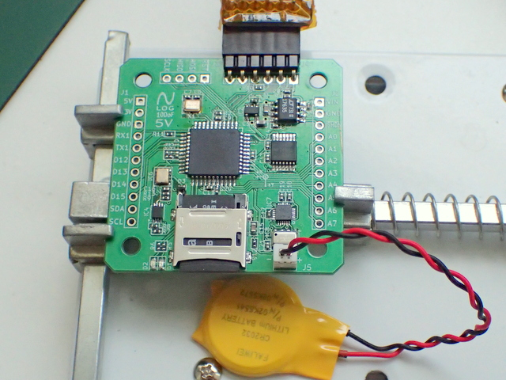

# nlog_10DOF-2018-
arduino compatible embedded microSD data logger (2018)

----------

## Features ##

- minor update of nLog_9DoF (added Air Pressure sensor)
- 5V and 3.3V Regurator
- ATmega644P (4kB RAM 64kB ROM) 5V 16MHz 
- Size and pin pitch compatible with UP-204GSR Universal PCB
- microSD hinge socket 
- MPU-9250
- MS5611  Baromater
- RX8900 RealTime Clock (TCXO) (Backup Battery Option)
- 3.3V I2C bus, 5V UART,SPI, ADC/GPIO 

----------
## PIN Map ##

- VIN has Reverse current protection

----------

## Applications ##

- analog & Motion Datalogger

----------

## Project Environment ##

- KiCad (4.0.1)
- Arduino 1.0.6
- Sanguino bootloader
- SDfatlib

## Project Status ##

- end of life (EOL)
 